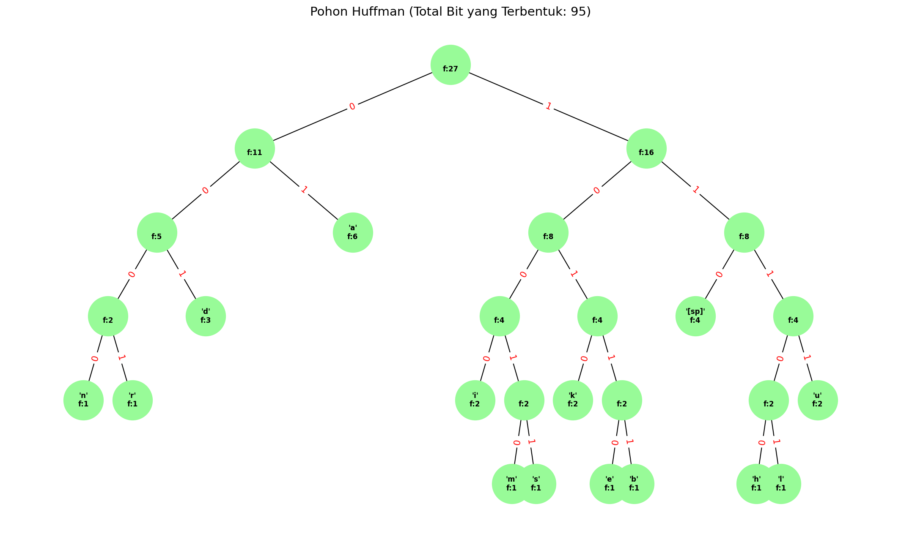

## 1. Rangkuman Teori Graf & Aplikasi (Poin 30)

**Definisi dan Konsep Dasar:**
Berdasarkan materi perkuliahan, Graf G = (V, E) adalah sebuah struktur diskret yang terdiri dari dua himpunan utama: set simpul (V) yang merepresentasikan objek-objek, dan set sisi (E) yang merepresentasikan hubungan atau relasi antar objek tersebut. Graf digunakan sebagai instrumen matematis untuk memodelkan berbagai persoalan diskret yang melibatkan konektivitas dan jaringan.

**Aplikasi di Kehidupan Sehari-hari:**

1. 
**Masalah Lintasan Terpendek (Shortest Path):** Implementasi graf sangat krusial dalam sistem navigasi untuk menentukan rute paling efisien antara dua lokasi, contohnya penggunaan algoritma Dijkstra dalam aplikasi peta digital.

2. 
**Pewarnaan Graf (Graph Coloring):** Digunakan dalam manajemen penjadwalan (seperti jadwal kuliah) guna menghindari konflik pada waktu yang sama, atau dalam kartografi untuk mewarnai wilayah peta agar daerah yang bersinggungan memiliki warna berbeda.

3. 
**Pohon Merentang Minimum (Minimum Spanning Tree/MST):** Sangat berguna dalam perancangan infrastruktur jaringan, seperti menentukan jalur kabel telepon atau pipa air dengan total biaya material paling murah namun tetap menghubungkan semua titik.

**Analogi Konseptual:**
Graf dapat dianalogikan seperti sebuah **Peta Harta Karun**. Dalam konteks ini, **Simpul** bertindak sebagai titik lokasi harta karun berada, sedangkan **Sisi** adalah jalan setapak yang menghubungkan antar lokasi tersebut. Teori graf diaplikasikan untuk menganalisis rute mana yang paling cepat untuk sampai ke tujuan atau memastikan semua lokasi telah dikunjungi dengan langkah yang paling efisien.

---

## 2. Analisis Struktur Graf (Poin 35)

Berdasarkan pengamatan pada graf kiri (simpul a-h) dan graf kanan (simpul 1-8):

### (a) Analisis Isomorfisma

**Jawaban:** Ya, kedua graf tersebut adalah **Isomorfik**.
**Alasan:**

* 
**Kuantitas Elemen:** Keduanya memiliki jumlah simpul yang sama (n = 8) dan jumlah sisi yang sama (e = 12).

* **Derajat Simpul:** Semua simpul pada kedua graf memiliki derajat 3 (setiap titik terhubung ke tiga titik lainnya). Hal ini menjadikan keduanya sebagai *3-regular graph* atau graf teratur derajat 3.

* **Korespondensi Struktur:** Terdapat pemetaan satu-ke-satu yang menjaga hubungan ketetanggaan. Graf kanan adalah representasi visual dari sebuah kubus, dan graf kiri adalah representasi planar dari struktur kubus yang sama namun digambarkan secara melingkar.

### (b) Karakteristik Lintasan (Euler & Hamilton)

Berdasarkan syarat matematis pada materi perkuliahan:

* 
**Bukan Graf Euler/Semi-Euler:** Syarat graf Euler adalah semua simpul harus berderajat genap, sedangkan pada graf ini seluruh simpul berderajat 3 (ganjil). Syarat semi-Euler adalah memiliki tepat dua simpul ganjil, sedangkan graf ini memiliki delapan simpul ganjil.

* 
**Graf Hamilton:** Ya, karena graf ini memiliki sirkuit Hamilton yang mengunjungi setiap simpul tepat satu kali.

* 
**Contoh Sirkuit Hamilton (Graf Kanan):** 1 - 2 - 4 - 6 - 8 - 7 - 5 - 3 - 1.

---

## 3. Algoritma Huffman & Encoding (Poin 35)

**String:** "`daku dan dia kuliah bersama`" (27 karakter termasuk spasi).

### (a) Pembentukan Pohon Huffman

Langkah-langkah pembentukan berdasarkan algoritma Huffman:

1. 
**Tabulasi Frekuensi:** a(6), spasi(4), d(3), u(3), k(2), i(2), n(1), l(1), h(1), b(1), e(1), r(1), s(1), m(1).

2. 
**Konstruksi:** Gabungkan dua karakter dengan frekuensi terkecil secara berurutan hingga membentuk satu akar utama bernilai 27.

Karakter dengan frekuensi tinggi seperti 'a' akan terletak lebih dekat ke akar pohon (mendapat kode bit pendek), sedangkan karakter berfrekuensi rendah akan berada di bagian bawah (mendapat kode bit panjang).
$$
\sum \text{frekuensi} \times \text{panjang bit}
$$

**Visualisasi Pohon Huffman:**

### (b) Estimasi Jumlah Bit

Jumlah total bit dihitung dengan menjumlahkan hasil kali antara frekuensi karakter dengan panjang lintasannya di pohon $\sum \text{frekuensi} \times \text{panjang bit}$.

* Dibandingkan dengan pengkodean standar 8-bit (ASCII) yang memerlukan 216 bit (27 × 8 = 216), penggunaan Huffman menghasilkan **95 bit**.

* Ini menunjukkan efisiensi penyimpanan sebesar **56%** ((216 - 95) / 216 ≈ 0.56).

---
